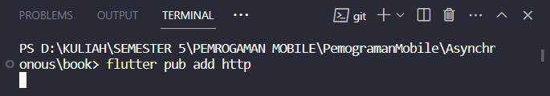
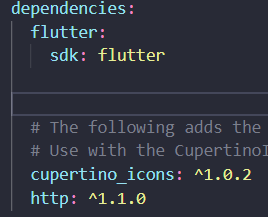

# Pemrograman Asynchronous di Flutter

**Nama: Evi Amalia Midfia**

**Kelas: TI-3A**

**Absen: 13**

**NIM: 2141720030**

## Praktikum 1: Mengunduh Data dari Web Service (API)

#### Langkah 1: Buat project baru
Kemudian Tambahkan dependensi http dengan mengetik perintah berikut di terminal.


#### Langkah 2: Cek file pubspec.yaml
Jika berhasil install plugin, pastikan plugin http telah ada di file pubspec ini seperti berikut.



#### Langkah 3: Buka file main.dart

Ketiklah kode seperti berikut ini.
```import 'dart:async';
import 'dart:ui';
import 'package:flutter/material.dart';
import 'package:http/http.dart';
import 'package:http/http.dart' as http;

void main() {
  runApp(const MyApp());
}

class MyApp extends StatelessWidget {
  const MyApp({super.key});

  @override
  Widget build(BuildContext context) {
    return MaterialApp(
      title: 'Evi Amalia Midfia', //soal 1
      theme: ThemeData(
        primarySwatch: Colors.blue,
        visualDensity: VisualDensity.adaptivePlatformDensity,
      ),
      home: const FuturePage(),
    );
  }
}

class FuturePage extends StatefulWidget {
  const FuturePage({super.key});

  @override
  State<FuturePage> createState() => _FuturePageState();
}

class _FuturePageState extends State<FuturePage> {
  String result = '';
  @override
  Widget build(BuildContext context) {
    return Scaffold(
      appBar: AppBar(
        title: const Text('Back from the Future'),
      ),
      body: Center(
        child: Column(children: [
          const Spacer(),
          ElevatedButton(
            child: const Text('GO!'),
            onPressed: (),
          ),
          const Spacer(),
          Text(result),
          const Spacer(),
          const CircularProgressIndicator(),
          const Spacer(),
        ]),
      ),
    );
  }
```

#### Langkah 4: Tambah method getData()
Tambahkan method ini ke dalam class _FuturePageState yang berguna untuk mengambil data dari API Google Books.


**Soal 2**


**Output**


#### Langkah 5: Tambah kode di ElevatedButton
Tambahkan kode pada 'onPressed' di 'ElevatedButton' seperti berikut.


**Output**

https://github.com/evi03/PemogramanMobile/assets/95482289/f7a36c61-fef2-40c8-9538-7c2af3321dfa

> **substring:** Ini adalah langkah untuk mengambil sebagian teks dari badan respons. digunakan untuk mengambil 450 karakter pertama dari badan respons. Hal ini dilakukan agar tidak menampilkan terlalu banyak teks. **CatchError**: Ini adalah bagian dari Future API yang menangkap kesalahan yang mungkin terjadi selama eksekusi Future. Jika ada kesalahan selama pemanggilan `getData`, blok kode dalam `.catchError` akan dijalankan. Pada contoh ini, jika terjadi kesalahan, variabel `result` akan diatur dengan pesan kesalahan 'An error occurred'. Jadi, secara keseluruhan, kode tersebut berfungsi untuk mengambil data dari permintaan HTTP setelah tombol "GO!" ditekan, kemudian memproses responsnya, dan menampilkan hasil atau menangani kesalahan jika ada.

## Praktikum 2: Menggunakan await/async untuk menghindari callbacks

#### Langkah 1: Buka file main.dart

Tambahkan tiga method berisi kode seperti berikut di dalam 'class _FuturePageState'.


#### Langkah 2: Tambah method count()

Lalu tambahkan lagi method ini di bawah ketiga method sebelumnya.


#### Langkah 3: Panggil count()

Lakukan comment kode sebelumnya, ubah isi kode onPressed() menjadi seperti berikut.


#### Langkah 4: Run

Akhirnya, run atau tekan F5 jika aplikasi belum running. Maka Anda akan melihat seperti gambar berikut, hasil angka 6 akan tampil setelah delay 9 detik.


## Praktikum 3: Menggunakan Completer di Future

#### Langkah 1: Buka main.dart
Pastikan telah impor package async berikut.


#### Langkah 2: Tambahkan variabel dan method
Tambahkan variabel late dan method di class _FuturePageState seperti ini.


#### Langkah 3: Ganti isi kode onPressed()
Tambahkan kode berikut pada fungsi onPressed(). Kode sebelumnya bisa Anda comment.


#### Langkah 4:
Terakhir, run atau tekan F5 untuk melihat hasilnya jika memang belum running. Bisa juga lakukan hot restart jika aplikasi sudah running. Maka hasilnya akan seperti gambar berikut ini. Setelah 5 detik, maka angka 42 akan tampil.


> Maksud kode langkah 2 yaitu untuk menciptakan dan menyelesaikan Future secara manual dengan menggunakan Completer. Ini dapat berguna dalam situasi di mana perlu mengontrol sendiri kapan suatu Future selesai.

#### Langkah 5: Ganti method calculate()
Gantilah isi code method calculate() seperti kode berikut, atau Anda dapat membuat calculate2()


#### Langkah 6: Pindah ke onPressed()
Ganti menjadi kode seperti berikut.


**Output**

belum di ss

> Kode langkah 2 lebih berfokus pada komunikasi dengan API eksternal (Google Books) untuk mendapatkan data.
Kodelangkah 5 dan 6 menunjukkan penggunaan Completer untuk mengelola suatu Future yang melibatkan perhitungan asinkron yang lebih sederhana.
