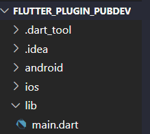

# Manajemen Plugin

<<<<<<< HEAD
#### Langkah 1: Buat Project Baru

=======
# Praktikum
### Langkah 1: Buat Project Baru

### Langkah 2: Menambahkan Plugin
Tambahkan `plugin auto_size_text` menggunakan perintah berikut di terminal. Jika berhasil, maka akan tampil nama plugin beserta versinya di file `pubspec.yaml` pada bagian dependencies.
* Menambahkan `plugin auto_size_text` pada terminal 

* Tampilan nama plugin beserta versinya di file `pubspec.yaml` pada bagian dependencies.

**Penjelasan Langkah 2**

Kode `flutter pub add auto_size_text` digunakan untuk menambahkan paket `auto_size_text` ke proyek Flutter. Paket ini digunakan untuk menyesuaikan ukuran font teks di aplikasi secara otomatis untuk berbagai ukuran layar.

### Langkah 3: Buat file red_text_widget.dart
Buat file baru bernama `red_text_widget.dart` di dalam folder lib lalu isi kode seperti berikut.

### Langkah 4: Tambah Widget AutoSizeText
Masih di file `red_text_widget.dart`, untuk menggunakan plugin `auto_size_text`, ubahlah kode `return Container()` menjadi seperti berikut.

Setelah Anda menambahkan kode di atas, Anda akan mendapatkan info error. Mengapa demikian? Jelaskan dalam laporan praktikum Anda!

**Jawab:** Kesalahan terjadi karena mencoba menggunakan variabel `text` dalam widget `AutoSizeText`, tetapi tidak mendefinisikan atau menginisialisasi variabel `text` di dalam kelas `red_text_widget`. Oleh karena itu, Flutter tidak dapat menemukan variabel `text` yang coba digunakan, dan inilah yang menyebabkan kesalahan. Untuk mengatasi masalah ini, perlu dilakukan inisialisasi variabel `text` di dalam kelas `red_text_widget` atau memberikan nilai yang sesuai saat membuat instance dari kelas ini. Serta kurangnya impor yang diperlukan untuk AutoSizeText dan Colors, Untuk mengatasi masalah ini, perlu menambahkan impor paket yang sesuai ke dalam file red_text_widget.dart `import 'package:auto_size_text/auto_size_text.dart';`.

### Langkah 5: Buat Variabel text dan parameter di constructor
Tambahkan variabel `text` dan parameter di constructor seperti berikut.

**Penjelasan langkah 5** 
Kode di atas digunakan untuk menambahkan variabel `text` dan parameter di constructor kelas `RedTextWidget`. Ini memungkinkan untuk mengirim teks yang akan ditampilkan oleh widget `RedTextWidget` saat membuat instance dari kelas tersebut. Dengan penambahan kode tersebut, memberikan fleksibilitas pada widget `RedTextWidget` untuk menampilkan teks yang berbeda sesuai dengan nilai yang diberikan ketika menggunakannya dalam aplikasi Flutter. Variabel `text` akan menyimpan teks yang diberikan dan digunakan dalam widget `AutoSizeText` di dalam `RedTextWidget`.

### Langkah 6: Tambahkan widget di main.dart
Buka file `main.dart` lalu tambahkan di dalam `children`: pada `class _MyHomePageState`

**Terdapat dua widget yang ditambahkan, jelaskan fungsi dan perbedaannya!**
**Jawab:** Dua widget yang ditambahkan adalah `RedTextWidget` dan `Text`.
1. RedTextWidget:
   - `RedTextWidget` adalah widget khusus yang dibuat sendiri (custom widget) berdasarkan kelas yang definisikan sebelumnya.
   - Ini mengambil satu parameter, yaitu `text`, yang digunakan untuk menentukan teks yang akan ditampilkan dalam widget ini saat membuat instance darinya.
   - `RedTextWidget` menggunakan `AutoSizeText` untuk menampilkan teks, yang dapat secara otomatis menyesuaikan ukuran font sesuai dengan ruang yang tersedia di dalam widget ini.

2. Text:
   - `Text` adalah widget bawaan Flutter yang digunakan untuk menampilkan teks dalam tampilan statis.
   - Ini tidak memiliki parameter khusus seperti `RedTextWidget`, jadi harus menentukan teks secara langsung sebagai argumen dalam widget `Text`.

Perbedaan antara `RedTextWidget`dan `Text` adalah bahwa `RedTextWidget` merupakan custom widget yang memungkinkan mengatur teks secara dinamis dengan parameter `text`, sementara `Text` adalah widget bawaan yang menampilkan teks statis tanpa parameter khusus. Selain itu, `RedTextWidget` menggunakan `AutoSizeText` untuk penyesuaian ukuran font otomatis, sementara `Text` tidak memiliki fitur ini secara bawaan. 

**Run** aplikasi tersebut dengan tekan **F5**, maka hasilnya akan seperti berikut.

# Tugas Praktikum
**1. Selesaikan Praktikum Menerapkan Plugin di Project Flutter diatas, lalu dokumentasikan dan push ke repository Anda berupa screenshot hasil pekerjaan beserta penjelasannya di file README.md!**

**2. Jelaskan maksud dari langkah 2 pada praktikum tersebut!**

**Jawab:** Kode `flutter pub add auto_size_text` digunakan untuk menambahkan paket `auto_size_text` ke proyek Flutter. Paket ini digunakan untuk menyesuaikan ukuran font teks di aplikasi secara otomatis untuk berbagai ukuran layar.

**3. Jelaskan maksud dari langkah 5 pada praktikum tersebut!**

**Jawab:** Kode di atas digunakan untuk menambahkan variabel `text` dan parameter di constructor kelas `RedTextWidget`. Ini memungkinkan untuk mengirim teks yang akan ditampilkan oleh widget `RedTextWidget` saat membuat instance dari kelas tersebut. Dengan penambahan kode tersebut, memberikan fleksibilitas pada widget `RedTextWidget` untuk menampilkan teks yang berbeda sesuai dengan nilai yang diberikan ketika menggunakannya dalam aplikasi Flutter. Variabel `text` akan menyimpan teks yang diberikan dan digunakan dalam widget `AutoSizeText` di dalam `RedTextWidget`.

**4. Pada langkah 6 terdapat dua widget yang ditambahkan, jelaskan fungsi dan perbedaannya!**

**Jawab:** Dua widget yang ditambahkan adalah `RedTextWidget` dan `Text`.
1. RedTextWidget:
   - `RedTextWidget` adalah widget khusus yang dibuat sendiri (custom widget) berdasarkan kelas yang definisikan sebelumnya.
   - Ini mengambil satu parameter, yaitu `text`, yang digunakan untuk menentukan teks yang akan ditampilkan dalam widget ini saat membuat instance darinya.
   - `RedTextWidget` menggunakan `AutoSizeText` untuk menampilkan teks, yang dapat secara otomatis menyesuaikan ukuran font sesuai dengan ruang yang tersedia di dalam widget ini.

2. Text:
   - `Text` adalah widget bawaan Flutter yang digunakan untuk menampilkan teks dalam tampilan statis.
   - Ini tidak memiliki parameter khusus seperti `RedTextWidget`, jadi harus menentukan teks secara langsung sebagai argumen dalam widget `Text`.

Perbedaan antara `RedTextWidget`dan `Text` adalah bahwa `RedTextWidget` merupakan custom widget yang memungkinkan mengatur teks secara dinamis dengan parameter `text`, sementara `Text` adalah widget bawaan yang menampilkan teks statis tanpa parameter khusus. Selain itu, `RedTextWidget` menggunakan `AutoSizeText` untuk penyesuaian ukuran font otomatis, sementara `Text` tidak memiliki fitur ini secara bawaan. 

**5. Jelaskan maksud dari tiap parameter yang ada di dalam plugin auto_size_text berdasarkan tautan pada dokumentasi ini !**

**Jawab:** 
- key = Kunci unik (identifier) untuk widget AutoSizeText. Ini berguna untuk mengidentifikasi widget ini secara unik dalam pohon widget.
- textKey = Kunci yang diberikan untuk teks yang akan ditampilkan. Digunakan untuk mengidentifikasi teks secara unik dalam konteks widget ini.
- style = Gaya teks yang digunakan untuk mengatur tampilan teks, termasuk warna, ukuran font, dan atribut lainnya.
- minFontSize = Ukuran font minimum yang akan digunakan untuk teks. Ini memastikan bahwa teks tidak akan lebih kecil dari ukuran ini bahkan jika teks sangat panjang.
- maxFontSize = Ukuran font maksimum yang digunakan untuk teks. Ini memastikan bahwa teks tidak akan lebih besar dari ukuran ini.
- stepGranularity = Langkah kenaikan atau penurunan ukuran font saat menyesuaikan teks. Ini memungkinkan untuk mengatur seberapa halus perubahan ukuran font saat teks beradaptasi.
- presetFontSizes = Daftar ukuran font yang tersedia untuk digunakan saat menyesuaikan teks.
- group = Kelompok yang digunakan untuk mengontrol ukuran font bersama-sama dalam satu kelompok. Misalnya, Anda dapat memiliki beberapa widget AutoSizeText dalam satu grup sehingga ukuran font mereka akan disesuaikan bersama-sama.
- textAlign = Penyelarasan teks dalam widget, seperti kiri, kanan, tengah, atau kanan-ke-kiri.
textDirection = Arah teks, seperti dari kiri ke kanan (LTR) atau dari kanan ke kiri (RTL).
- locale = Konfigurasi bahasa dan negara untuk teks. Ini mempengaruhi cara teks ditampilkan dan format numerik.
- softWrap = Menentukan apakah teks dapat mematahkan baris (soft wrap) atau harus diatur dalam satu baris.
wrapWords = Menentukan apakah kata-kata dalam teks dapat mematahkan baris.
- overflow = Cara menangani teks jika melebihi ukuran yang tersedia. Pilihan meliputi ellipsis (tanda titik-titik), fade (memudar), atau clip (memotong).
overflowReplacement = Widget yang digunakan sebagai pengganti jika teks melebihi ruang yang tersedia.
- textScaleFactor = Faktor skalasi ukuran teks yang memungkinkan pengubahan ukuran font teks secara keseluruhan.
- maxLines = Jumlah maksimum baris yang dapat ditampilkan dalam teks. Jika terlampaui, akan diterapkan tindakan overflow yang ditentukan.
- semanticsLabel = Label semantik yang digunakan untuk aksesibilitas, membantu pengguna dengan berbagai kebutuhan aksesibilitas memahami konten teks dengan benar.

**6. Kumpulkan laporan praktikum Anda berupa link repository GitHub melalui Assignment ini !**
>>>>>>> 0d104ed257a28244d6821ed12ebd8d2c38a3c537
